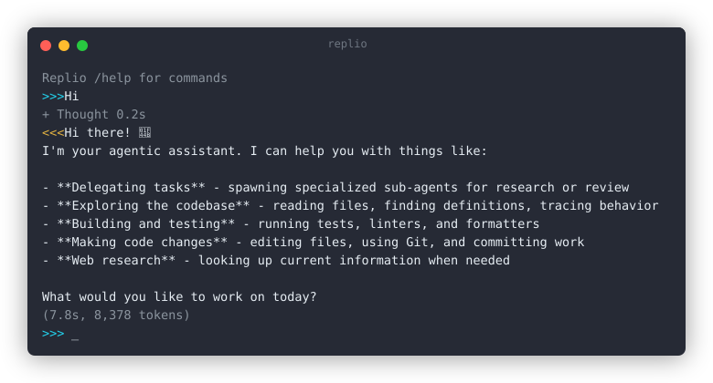

# Replio

**A lightweight, zero-dependency agentic core for fleets of single-purpose agents.**

<p>
  <a href="https://pypi.org/project/replio/"></a>
  =3.10">
  
  
  
</p>

Replio is a deliberately small, auditable, zero-dependency agentic core built on a single streaming loop. The model plans, the tool registry acts, and the same loop powers an interactive REPL, a headless CLI, and an HTTP API. Each process is a self-contained agent scoped to one folder, with its own config, model, and tool permissions. Agents compose into larger systems through three orchestration layers - swarm (personas and delegation), jobs (scheduled, durable work), and fleet (a supervisor for many agents) - with MCP for cross-tool interoperability.

<p align="center"></p>

## Features

### Core

- **Zero dependencies** - everything is Python standard library. Nothing to audit, no supply chain, no lockfile churn
- **One agent loop** - a single SSE stream per turn powers the REPL, the CLI, and the API. No duplicated logic across front-ends
- **Local-first** - config and session logs live on your disk. Bring your own provider key, or run fully local
- **Multi-provider** - Ollama, OpenAI, Groq, Anthropic, OpenCode Zen/Go, plus any OpenAI-compatible endpoint, with automatic detection from the base URL
- **Agentic REPL** - streaming token-by-token output, dimmed thinking, markdown-aware rendering, readline history, tab completion, and multi-line `"""` blocks
- **Tool calling** - web search and page fetch, file read/write/list/glob/grep/edit, git status/diff/commit, test/lint/format wrappers, and shell execution via OpenAI-compatible function calling, or directly with `/tool`
- **Permissions** - every tool is gated by `allow` / `ask` / `deny`, with path-scoped confirmation outside your worktree and an audit trail in session logs
- **Modes** - named postures with their own instructions and permissions: `plan` (read-only) vs `build`, or custom modes, switchable live with `/mode` or via `--mode`
- **Sessions** - complete append-only conversation logs that capture every tool call, result, and error, plus `/compact` and Markdown export
- **Plugins** - external repositories register tools, providers, slash commands, and services. The core stays zero-dependency, and plugin deps are imported lazily
- **Headless** - `replio run` for scripting and `replio serve` for an HTTP JSON API over the same agent loop

### Orchestration

- **Swarm** - make agents cooperate. A persona catalog (bundled defaults plus global/local `.replio/personas.json`) and the `delegate` tool, which runs a task under a persona as an in-process sub-agent with its own `sub_*` session log, its own prompt, model override, and tool permissions. Manage personas with `/persona` (and tag-filter them)
- **Jobs** - scheduled, durable workflows with built-in discipline. Cron / interval / one-shot schedules, retries with exponential backoff, per-run timeouts, linked Markdown task files, a rolling run-memory summary, and human-in-the-loop approvals. Managed by `replio jobs`, `/jobs`, and the long-running `replio jobs daemon`
- **Fleet** - run many scoped agents under one supervisor. `replio fleet` allocates conflict-free ports, health-checks every `replio serve` child, restarts failures with a bounded backoff, and generates per-agent configs - with `status`, `logs`, and `restart` for ops, foreground or detached
- **MCP (Model Context Protocol)** - work alongside other AI tools. Import external MCP servers' tools, or expose Replio's policy-filtered tools and session resources to other agents over `replio mcp` or `POST /mcp`

The layers are complementary: **fleet keeps agents alive, swarm cooperates, jobs schedule the work.** All speak the same API, so they compose - a supervised fleet agent can delegate by persona, and a job can drive a team.

## Quick Start

```bash
pipx install replio
replio
```

Or from source:

```bash
git clone https://github.com/emyasnikov/replio.git && cd replio
python3 -m venv .venv && .venv/bin/pip install -e .
.venv/bin/replio
```

## Usage

### REPL

First-time setup with `/connect`, then type any message. Tab-complete `/` commands and session names. Use arrow keys to navigate history.

Open a `"""` or `'''` block to type a multi-line prompt. The block's framing quotes are stripped, and the whole message is sent as one turn. Ctrl-C exits the REPL from anywhere, including inside an open block.

```
>>> /connect
  Provider [ollama]:
  Base URL [https://ollama.com]:
  API key: ...
  Model [gpt-oss:20b-cloud]:
>>> Hi
<<< Hello! How can I help you today?
>>> /exit
```

### CLI

Stream plain text with `--output text` or return the results as JSON, log tool status and diagnostics to stderr with `--verbose`, and address a persistent session with `--session-id <id>`. Tools that require confirmation are auto-denied in by default, just pass `--yes` to approve them.

```bash
replio run --prompt "Hi"
{
  "content": "Hello! How can I help you today?",
  "thinking": null,
  "tool_calls": [],
  "errors": [],
  "duration": 7.0,
  "usage": null,
  "model": "gpt-oss:20b-cloud",
  "provider": "ollama",
  "session": "20260814_192251_hi",
  "status": "ok"
}
```

### API

`replio serve` exposes JSON endpoints - `POST /chat {"prompt": "..."}` (optionally with `"session_id"`) returns the same turn result as the CLI.

```bash
replio serve &
curl localhost:8787/chat -X POST -d '{"prompt": "Hi"}'
{"content": "Hello! How can I help you today?", "thinking": null, "tool_calls": [], "errors": [], "duration": 7.0, "usage": null, "model": "gpt-oss:20b-cloud", "provider": "ollama", "session": "20260814_192711_hi", "status": "ok"}
```

### Swarm - delegation by persona

A lead agent (or you) hands a task to a specialized persona. The sub-agent runs in-process, writes its own session log, and returns its final answer. Personas are model- and permission-scoped: a researcher is read-only, a programmer may run shell.

```
>>> /persona list
>>> /tool delegate {"persona": "researcher", "task": "Summarize docs/ and cite sources"}
[delegate researcher] <final answer of the research sub-agent, sources cited>
```

The REPL shows the sub-agent's dimmed activity and a duration footer as it works.

See [docs/swarm.md](docs/swarm.md) and [docs/personas.md](docs/personas.md).

### Jobs - scheduled durable work

Jobs are human-gated workflows: `add` proposes, `approve` arms it, and the daemon fires it on schedule with retries and timeouts. The task lives in a Markdown file you edit in `$EDITOR`. A rolling memory summary carries context between runs.

```bash
replio jobs add nightly --file tasks/nightly.md --cron "0 2 * * *"
replio jobs approve nightly
replio jobs daemon            # polls on --tick 15s, Ctrl-C to stop
replio jobs status
```

See [docs/jobs.md](docs/jobs.md).

### Fleet - supervised agents

One agent per folder, each a `replio serve` process with its own config, permissions, and sessions. The supervisor allocates ports, health-checks, and restarts failures with a bounded backoff.

```bash
replio fleet init                                              # scan existing agent folders
replio fleet config docs-agent --persona researcher --port 8781
replio fleet up                                                # Ctrl-C = graceful down, or --detach
replio fleet status
replio fleet logs docs-agent -f
```

See [docs/fleet.md](docs/fleet.md).

### MCP - interop with other AI tools

Serve Replio's tools and sessions over Model Context Protocol, or connect outward to import another server's tools.

```bash
replio mcp    # stdio server, e.g. point Claude or opencode at it
```

On `replio serve` the same is available at `POST /mcp`. See [docs/mcp.md](docs/mcp.md).

## Roadmap

Fleet orchestration (v0.22), scheduled and durable jobs (v0.21), and the swarm foundations - bundled personas, in-process sub-agents, and the `delegate` tool (v0.20) - are live. Building next: auditor agents with generate > check > correct, the interactive `/agent` command and delegation focus, named team and job configs, the jobs operator API with webhook/email/Telegram connectors, a web Control UI over the JSON API, `/spawn` from the REPL, and remote channels. See [docs/fleet.md](docs/fleet.md), [docs/jobs.md](docs/jobs.md), [docs/swarm.md](docs/swarm.md), and the open tasks in [TODO.md](TODO.md).

## Contributing

The project is stdlib-only with no external dependencies. See [AGENTS.md](AGENTS.md) for architecture and conventions, and [CONTRIBUTING.md](CONTRIBUTING.md) for the contribution workflow.

## Documentation

Detailed references are in [docs/index.md](docs/index.md).

## License

[MIT](LICENSE)
